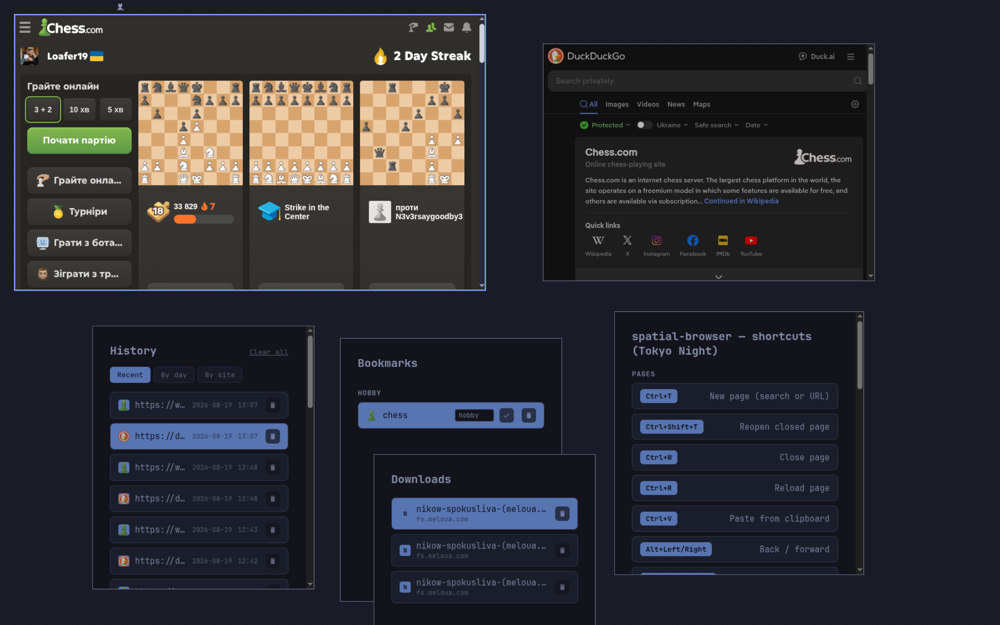

# spatial-browser

Personal browser shell: pages arranged as pannable/zoomable tiles on a
canvas instead of flat tabs, with its own bookmarks/history/downloads UI.



## Architecture

- **Web engine:** CEF (Chromium Embedded Framework), off-screen rendering.
- **Compositor:** `wgpu`, draws pages as textured quads on the canvas.
- **Chrome UI** (new-page prompt, bookmarks/downloads/history lists, page
  switcher, help): no address bar — server-rendered `data:` HTML pages,
  loaded as ordinary CEF pages. Each one signals back to the compositor
  via a fake `whatever://...` URL, intercepted by `cef-bridge`'s
  `RequestHandler` (see `cef-bridge/src/navigation.rs`).
- **Plugins:** planned, not started.

## Layout

- `crates/compositor` — window, wgpu surface, canvas renderer, CEF
  process bootstrap and event loop.
  - `hotkeys.rs` — canvas-level shortcuts, grouped Pages / Lists /
    Canvas / Other.
  - `pages/` — generated `data:` HTML for each list/prompt page.
  - `pending_actions.rs` — drains the `PENDING_*` queues cef-bridge's
    CEF callbacks fill (bookmark/downloads/history/workspace list
    clicks, omnibox/switcher submissions, popups, completed
    downloads/visits) once a frame; split out of `app.rs` (which only
    routes raw window/input events) once it grew to hold both.
  - `clipboard_bridge.rs` — copy/paste (see Status: CEF's own clipboard
    doesn't work in this embedding at all).
  - `persistence/` — everything under `~/.config/spatial-browser/`,
    one JSON file per concern (session, bookmarks, downloads, history,
    typed-omnibox input, workspaces).
  - `session.rs`, `viewport.rs`, `browser.rs`, `input/`, `output/` —
    canvas state, world/screen mapping, CEF page spawning, input
    forwarding, wgpu pipeline.
- `crates/cef-bridge` — one file per CEF client-handler interface
  (`app`/`render`/`display`/`download`/`life_span`/`load`), plus
  `navigation` (the custom-scheme interceptions above, plus the
  clipboard-copy one) and `client` (ties them all together). No
  request-context handler: every page passes `None` for its request
  context, sharing CEF's one persistent global profile instead of each
  getting a fresh, isolated, in-memory-only one.

## Status

Multi-page spatial canvas: pan/zoom, drag/resize, z-order focus
cycling, auto-layout into a grid (Ctrl+G). Ctrl+T opens an omnibox
(`@g`/`@y`/`@ddg`/`@bing`/`@wiki` search shortcuts, typed-history);
Ctrl+K is a filterable switcher over open pages. Bookmarks (Ctrl+D/B),
downloads (Ctrl+J, to `~/Downloads`, desktop notification on
completion), and real browsing history (Ctrl+H, day/site grouping)
each have their own list page. A page opening a link in a new
tab/window spawns a canvas page instead of a native popup window.
Ctrl+Shift+C copies the focused page's URL — there's no address bar to
select it from. F1 (or Ctrl+/) shows every shortcut.

Ad/tracker request blocking (~55 known ad-serving/tracking domains,
matched at the request level, not just navigation) is on by default.
Settings (Ctrl+,): toggle it, pick a default search engine, add your
own extra blocked hosts on top of the built-in list, or switch the UI
theme directly instead of cycling it.

Every list page (bookmarks/downloads/history/workspaces/switcher)
shares the same row-highlight keyboard nav — ArrowUp/ArrowDown moves a
highlighted row, Enter activates it, same as the switcher's own — and
the same visual building blocks (favicon-with-fallback tile, icon
buttons, empty-state text), rather than each having quietly drifted its
own variant.

The canvas itself keeps every tile legible regardless of what's open:
an unfocused page gets a thin neutral border and is dimmed slightly so
the focused one visibly pops, a page with no CEF frame yet (still
loading) shows a pulsing placeholder instead of a blank tile, and the
bare canvas has a dot grid at a fixed world-space spacing — a spatial
reference that pans/zooms with everything on it, not a static
wallpaper. Ctrl+Shift+Space cycles the UI chrome's theme (Tokyo Night /
ANSI Terminal) — canvas colors, corner rounding, focus ring, and the F1
help page all switch together, since one `Theme` struct drives all of
them.

Workspaces (Ctrl+Shift+W): named save points for the whole canvas —
save snapshots every open page's URL/rect plus the current
viewport/theme as a new entry; load closes everything currently open
and reopens exactly what was saved (a "load a save file" model, not a
live auto-synced workspace). Renameable inline, deletable, persisted
to `workspaces.json`.

All pages share one persistent CEF profile (`~/.config/spatial-browser/
cef_data`) — cookies/logins carry over between tabs of the same site
and across restarts, unlike the per-page, in-memory-only contexts this
used to create.

**Known limitations, both confirmed empirically and worked around
rather than fixed upstream:**
- CEF hard-crashes on SPA-style client-side navigation (YouTube, Google
  Images lightbox) — a Chromium bug (`ReadAnythingSoftNavigationObserver`
  assuming a Tab exists, which a windowless/OSR embedding never has).
  Mitigated by `scripts/run.sh`, which auto-relaunches on crash and
  restores the saved canvas — unlike Chrome's own per-tab process
  isolation, this takes down the whole browser, not one tab.
- CEF's own clipboard integration doesn't work at all in this
  windowless/OSR embedding (no real platform surface to claim OS
  clipboard ownership through — copied text never reached the system
  clipboard). Copy/paste are reimplemented in `clipboard_bridge.rs`
  instead: a script injected into every page relays the 'copy' event's
  selection out to `wl-copy`; Ctrl+V is intercepted natively, reads
  `wl-paste` directly, and inserts via `execCommand('insertText', ...)`.
- Rendering via CEF's CPU OSR path, not the GPU shared-texture path yet
  (blocked on a hybrid-GPU cross-device import issue — see code
  comments in `cef-bridge/src/render.rs` for details).
- No extensions (no plugin host at all yet), no sync across devices, no
  password manager or form autofill, no DevTools panel in the UI.
- No find-in-page (Ctrl+F) — built once, reverted as too buggy, not
  currently supported. No full-text search across browsing history,
  bookmark import/export, tab groups, reading list, or a built-in PDF
  viewer either.
- Linux x86_64 only.

## Build

```sh
# One-time: bundle-cef-app, used by scripts/bundle.sh
cargo install cef --version 151.4.0+151.3.17 --locked \
  --root ~/.local/share/cargo-cef-tools
```

```sh
cargo build                    # compiles; auto-downloads CEF on first run
./scripts/bundle.sh compositor # bundles + the CEF subprocess helper
./scripts/run.sh compositor    # runs, auto-relaunching on crash
./scripts/install.sh           # adds an app-launcher entry (Super/wofi/rofi/...)
```

`install.sh` regenerates `~/.local/share/applications/spatial-browser.desktop`
pointing at wherever the repo currently lives — safe to re-run after moving
the checkout.

## Releases

A pushed version tag (`git tag v0.2.0 && git push --tags`) triggers
`.github/workflows/release.yml`: builds, bundles, and attaches a Linux
x86_64 tarball to a GitHub Release.

## License

MIT — see [LICENSE](LICENSE).
